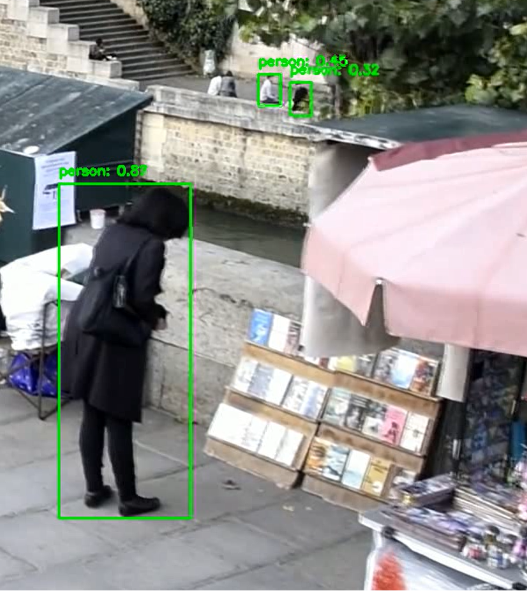
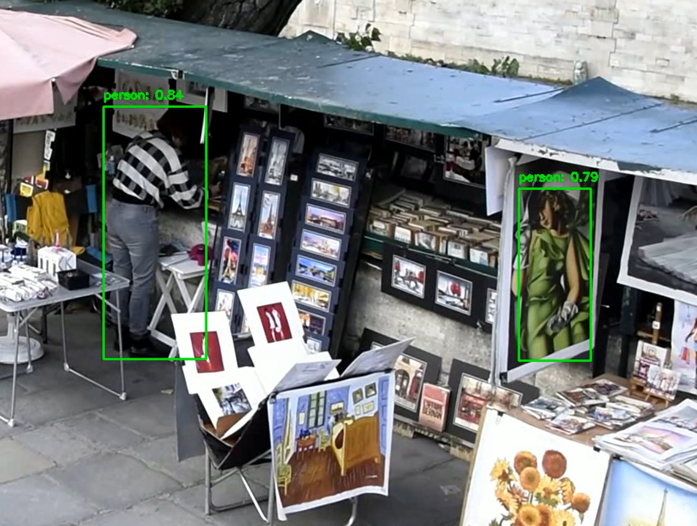

# Детекция людей на видео с помощью YOLOv8

В данном проекте с помощью модели YOLOv8 была решена задача по детекции людей на видео. В проекте реализована гибкая система конфигурации через config.py.

Пример получающихся кадров:


## Содержание
1. [Технологический стек](#технологический-стек)
2. [Структура проекта](#структура-проекта)
3. [Использование](#использование)
4. [Настройка параметров](#настройка-параметров)
5. [Результаты](#результаты)

## Технологический стек
- Python 3.8+
- OpenCV (cv2)
- Ultralytics YOLOv8
- tqdm (для отображения прогресса)

## Структура проекта
```bash
.
├── config.py # конфигурационный файл
├── crowd.mp4 # пример видео
├── people_detection.py # основной скрипт для обработки видео
├── pictures
│   ├── example_detection.jpeg
│   ├── far_detection.png
│   └── picture_detection.png
├── README.md
└── requirements.txt # зависимости
```

## Использование
1. Клонируйте репозиторий:
   ```bash
   git clone https://github.com/Guiuii/people_detection.git
   cd people_detection
   ```
   
2. Установите зависимости:
   ```bash
    pip install -r requirements.txt
   ```
    
3. Запустите скрипт:
   ```bash
   python people_detection.py
   ```
   
## Настройка параметров:
Все параметры настраиваются через файл config.py. Там можно выбрать другую модель YOLO, изменить параметры детекции (например, порог уверенности, порог IoU для NMS), поменять отображение bounding box и текста над ним.

## Результаты:

### Анализ качества распознования

Модель успешно обнаруживает людей на среднем и крупном планах. Также смогла распознать людей и вдалеке.



Точность bounding boxes:
- Адекватное определение границ объектов
- Хорошее определение границ даже в плотных скоплениях людей

Обладает хорошей точностью при хорошем освещении и четкой видимости объектов.

Поскольку использовалась довольно крупная модедь - yolov8m, удалось добиться хорошего баланса между точностью детекции и ресурсозатратностью.

Недостаток, который можно отметить - ложноположительная детекция женщины, нарисованной на картине. Причем с довольно большой степенью уверенности = 0.79 



### Шаги по дальнейшему улучшению
**Дообучение YOLO.** Для этого необходимо:

Собрать данные:
- Скриншоты кадров, где YOLO ошибочно детектит картины.
- Другие изображения с картинами/постерами из интернета.

Разметить данные:
- В разметочном инструменте (например, CVAT) отметить картины как фоновые объекты (background).

Дообучить модель:
```python
from ultralytics import YOLO

model = YOLO("yolov8m.pt") 
model.train(data="your_dataset.yaml", epochs=10, imgsz=640)
```

Также с целью улучшения качества детекции можно поробовать следующие подходы:

1. Настройка параметров детекции
   
**Повышение порога уверенности**: увеличить conf (например, до 0.8–0.9), чтобы модель игнорировала сомнительные объекты.

2. Контекстные правила
   
**Движение**: на видео реальные люди обычно двигаются. Использовать фоновый субстрактор (например, OpenCV MOG2) или трекинг (ByteTrack), чтобы отсечь статичные ложные объекты.

3. Использование дополнительных моделей
   
**Классификация текстуры**: пропустить все bbox с "людьми" через простой классификатор (например, ResNet18, но нужны примеры и дообучение).

**Детекция плоских объектов**: сегментация (например, Segment Anything) или детекция рамок картин.
